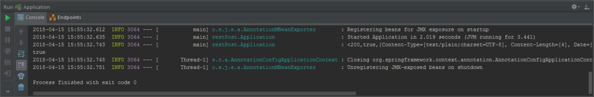

Створення RESTful сервера
===
Сервер обробляє HTTP запит POST з фото, який надсилає клієнт за певною адресою, та після цього повертає йому відповідь.

### Підключення необхідних бібліотек
* Для обробки запиту
```java
import org.springframework.stereotype.Controller;
import org.springframework.web.bind.annotation.PostMapping;
import org.springframework.web.bind.annotation.RequestMapping;
import org.springframework.web.bind.annotation.RequestParam;
import org.springframework.web.bind.annotation.ResponseBody;
```
* Для збереження фото
```java
import com.sun.org.apache.xerces.internal.impl.dv.util.Base64;
import javax.imageio.ImageIO;
import javax.script.*;
import java.awt.image.BufferedImage;
import java.io.*;
```

### Створення класу-контролера, який обробляє всі запити надіслані на адресу http://localhost:8080/demo
```java
@Controller
@RequestMapping(path="/demo") 
public class MainController {}
```

### Створення поля *directory* в *MainController*, який містить шлях до папки, куди збережеться фото
```java
String directory = "D:\\IntelliJ IDEA 2017.2.5\\RESTfulServer\\src\\main\\resources\\";
```

### Створення методу *isAllowed*, який обробляє запит POST, надісланий на адресу http://localhost:8080/demo/isAllowed
```java
@PostMapping(path="/isAllowed")
public @ResponseBody String isAllowed (@RequestParam String base64String) throws IOException {
    base64String = correctString(base64String);
    boolean result = toPhoto(base64String, "resultImage.jpg");
    return String.valueOf(result);
}
```

### Створення додаткових методів для реалізації *isAllowed*

* Метод **correctString** повертає в стрічку символи, які були втрачені під час запиту
```java
private String correctString(String base64String) {
    char [] string = base64String.toCharArray();
    StringBuilder result = new StringBuilder();
    for (int i = 0; i < string.length; i++) {
        if (string[i] == ' ')
            string[i] = '+';
        result.append(string[i]);
    }
    return result.toString();
}
```

* Метод **toPhoto** претворює отриману стрічку в зображення та зберігає його
```java
private boolean toPhoto (String base64String, String fileName) {
    try {
        byte[] resByteArray = Base64.decode(base64String);
        BufferedImage resultImage = ImageIO.read(new ByteArrayInputStream(resByteArray));
        ImageIO.write(resultImage, "jpg", new File(directory, fileName));
        return true;
    } catch (IOException e) {
        return false;
    }
}
```

### Створення класу *Application* за допомогою Spring Boot, який запускатиме сервер
```java
import org.springframework.boot.SpringApplication;
import org.springframework.boot.autoconfigure.SpringBootApplication;

@SpringBootApplication
public class Application {

    public static void main(String[] args) {
        SpringApplication.run(Application.class, args);
    }
}
```

### Відповідь
У результаті клієнт отримає відповідь на запит - **true** або **false** - відповідно до того, чи збережеться надіслане фото, чи ні.



